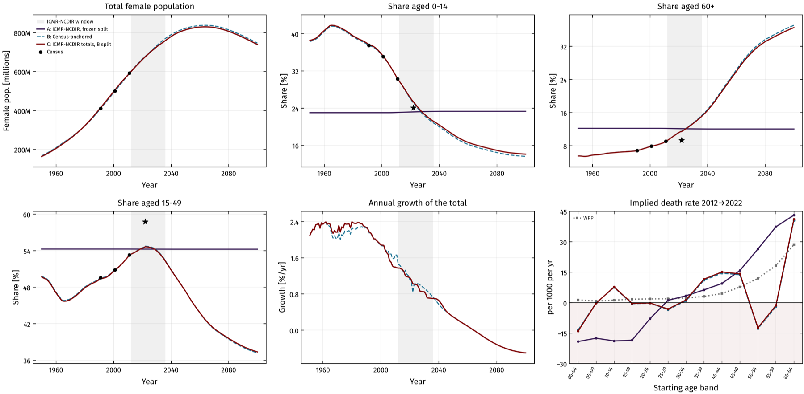
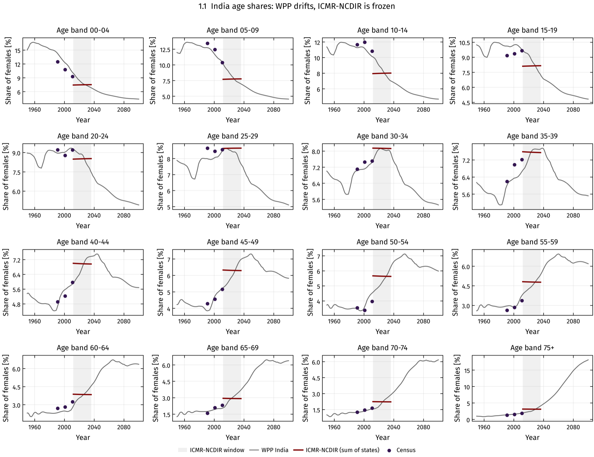
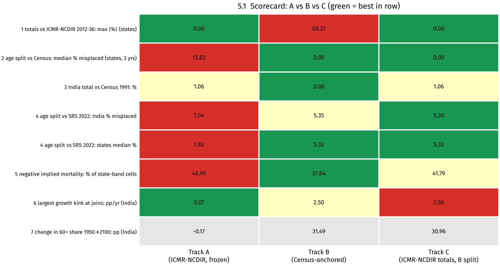
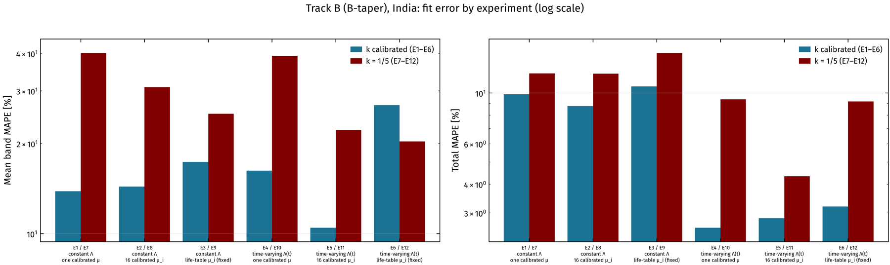

# Female population of India and its states by age, 1950–2100

Annual **female population for India and all 37 state/UT series × 16 five-year age bands (00–04 … 70–74, 75+) × 1950–2100**,
built by reconciling the ICMR-NCDIR state projections, the Census of India and UN World Population Prospects — plus a set of
**age-structured population ODE models** fitted to it.

Use it in two ways:

- **Use the data** — pre-built CSV / Excel / Parquet files in [`outputs/`](outputs/). No code needs to run.
- **Use or extend the code** — rebuild the data, change the method, or fit the population models with the notebooks in
  [`notebooks/`](notebooks/) and the Python modules in [`src/`](src/).

<p align="center"></p>

---

## Why this dataset

No public source gives consistent, annual, state-level female population by age over a long horizon:

| Source | Coverage | Limitation |
|---|---|---|
| ICMR-NCDIR state population projections | 37 states/UTs, 2012–2036, 16 bands | 25 years only; each state's **age split is fixed** for the whole period |
| UN World Population Prospects 2024 (WPP) | India, single ages, 1950–2100 | India only; levels differ from the Census |
| Census of India | All states, 1991 / 2001 / 2011 | Three years; state boundaries have changed since |
| SRS Statistical Report 2022 | India + 22 bigger states | One year (used here for validation only) |

The ICMR-NCDIR file is written as *state total × a fixed age split*: its totals follow a real projection, but its age
structure does not change over 25 years (30 series use a percentage table rounded to 0.1 %, 7 use their own Census 2011 split).
Joining it to the Census produces a large jump in 2011→2012 (e.g. −18 % in 00–04, +71 % in 75+).

<p align="center"></p>

## Three versions ("tracks") of the data

| Track | Totals | Age split | Use it when |
|---|---|---|---|
| **A** | ICMR-NCDIR, extended to 1950–2100 with WPP growth | ICMR-NCDIR's fixed split | ICMR-NCDIR's own numbers must be reproduced exactly |
| **B** | Census + WPP | Census-anchored, changes with time | Agreement with the Census and demographic consistency matter most (e.g. fitting population-dynamics models) |
| **C** | ICMR-NCDIR, extended as in A | Track B's split | Results must agree with ICMR-NCDIR's official totals **and** need a realistic age structure |

- **Track A** has four variants: `A1` (extend the total only), `A2` (extend each band), and `A1-blend` / `A2-blend`
  (growth fades smoothly into WPP's at 2012 and 2036).
- **Track B** has three national variants: `B-hold`, `B-taper`, `B-smooth` (how the Census/WPP correction behaves outside
  1991–2011), and two state rules (`hold`, `drift-damped`).
- **Track C** default: `B-taper` split × `A1-blend` totals.

<p align="center"></p>

| Criterion (India / states) | A | B | C |
|---|---|---|---|
| Totals vs ICMR-NCDIR 2012–2036 | exact | up to 68 % off (small units) | exact |
| Age split vs Census 1991 / 2001 / 2011 (median % misplaced) | 13.8 | exact | exact |
| Age split vs SRS 2022 — independent (India / states median, % misplaced) | 7.0 / 7.8 | 5.4 / 5.3 | 5.3 / 5.3 |
| Cohorts that grow with age (% of state-band cells, 2012→2022) | 47 | 38 | 42 |
| Age structure evolves over time | no | yes | yes |

## The data files

All populations are **absolute numbers of females**. Mid-year values.

| File | Contents |
|---|---|
| `outputs/csv/india_female_population_by_age_1950_2100.csv` | India, all tracks and variants, long format |
| `outputs/csv/states_female_population_by_age_1950_2100_track{A,B,C}.csv` | All 37 states/UTs, default variant of each track, long format |
| `outputs/trackA/trackA_india.xlsx` | India, one sheet per variant (A1, A1-blend, A2, A2-blend); wide (year × band + Total) |
| `outputs/trackA/trackA_states_<variant>.parquet` | States, long format, per variant |
| `outputs/trackB/trackB_india.xlsx` | India, one sheet per variant (B-hold, B-taper, B-smooth) |
| `outputs/trackB/trackB_states_B-hold_<rule>.parquet` | States, long format, per state rule |
| `outputs/trackB/census_anchors_harmonised.csv` | Census 1991/2001/2011 harmonised to today's 37 units |
| `outputs/trackC/trackC_india_<tag>.xlsx`, `trackC_states_<tag>.parquet` | Track C, India and states |
| `outputs/model/<track tag>/` | Population-model results: fit summary, errors by band, parameters (JSON), simulations |

CSV columns: `track, variant, unit, year, band, females`.

```python
import pandas as pd
df = pd.read_csv("outputs/csv/states_female_population_by_age_1950_2100_trackC.csv")
kerala_2030 = df.query("unit == 'Kerala' and year == 2030")
```

**States/UTs.** The 37 series follow ICMR-NCDIR's units (Andhra Pradesh and Telangana separate; Jammu & Kashmir and Ladakh
separate; Dadra & Nagar Haveli and Daman & Diu separate). **Today's boundaries are applied to all years**, including the past.
India = sum of the 37 series.

## Population models

`notebooks/02–04` fit a 16-compartment aging-chain ODE to each track:

$$\frac{dP_1}{dt} = \Lambda(t) - (k_1+\mu_1)P_1,\qquad
\frac{dP_i}{dt} = k_{i-1}P_{i-1} - (k_i+\mu_i)P_i,\qquad
\frac{dP_{16}}{dt} = k_{15}P_{15} - \mu_{16}P_{16}$$

Twelve experiments vary how recruitment $\Lambda$, mortality $\mu$ and maturation $k$ are represented:

| | Constant Λ: scalar μ | vector μ | life-table μ | Time-varying Λ(t): scalar μ | vector μ | life-table μ |
|---|---|---|---|---|---|---|
| **k calibrated** | E1 | E2 | E3 | E4 | E5 | E6 |
| **k = 1/band width = 1/5** | E7 | E8 | E9 | E10 | E11 | E12 |

Mean error across bands (MAPE, India, fitted 1950–2100):

| Track | Best (E5, 32 parameters) | E11 (E5 with k = 1/5) | E12 (1 parameter) |
|---|---|---|---|
| A (A1) | 3.8 % | 20.0 % | 22.9 % |
| B (B-taper) | 10.5 % | 22.2 % | 20.3 % |
| C | 9.6 % | 21.1 % | 19.5 % |

Fixing $k_i = 1/5$ roughly doubles band error; on Tracks B and C the 75+ band is the hardest to fit because constant mortality
cannot follow its large growth. Track A fits best largely because a fixed age split is easy for an aging chain to mimic. See each
notebook's results section for details.

<p align="center"></p>

## Quick start

```bash
git clone https://github.com/bisect-group/india-female-population-projections.git
cd india-female-population-projections
pip install -r requirements.txt
jupyter lab notebooks/
```

| Notebook | What it does | Runtime |
|---|---|---|
| `01_population_projections.ipynb` | Builds Tracks A, B, C from the raw data; diagnostics; writes `outputs/` | ~1 min |
| `02_population_model_trackA.ipynb` | Fits the 12 model experiments to Track A | ~1–2 min |
| `03_population_model_trackB.ipynb` | Same for Track B | ~1–2 min |
| `04_population_model_trackC.ipynb` | Same for Track C | ~1–2 min |

Notebooks 02–04 read the committed files in `outputs/`, so they run without notebook 01. All settings (track variant, state,
fit years, recruitment driver) are in the first code cell of each notebook; set `UNIT = "Kerala"` (or any state) to fit a state.

The modules can also be used directly:

```python
import sys; sys.path.insert(0, "src")
import popmodel as pm
data = pm.load_track("C", unit="Tamil Nadu")          # year x 16 bands
res = pm.fit("E12", data, pm.life_table_mu(), pm.lambda_driver(data))
print(res["metrics"]["mape"], res["k"].values)
```

## Repository layout

```
├── data/raw/            input data (see data/README.md for sources)
│   ├── icmr_ncdir/      ICMR-NCDIR state female projections 2012–2036
│   ├── wpp/             WPP 2024 India female population by single age 1950–2100
│   ├── census/          Census of India 1991, 2001, 2011 age-sex tables
│   ├── srs/             SRS Statistical Report 2022 (extracted tables; validation only)
│   └── life_table/      female death probabilities by age group (for fixed mortality)
├── notebooks/           01 data construction, 02–04 population models
├── src/                 popproj.py (data), popmodel.py (models), plotstyle.py (figure style)
├── outputs/             pre-built data products and model results
└── docs/                METHODS.md and README figures
```

Figures are written to `figures/` when notebooks run (not committed).

## Methods

Full description, equations and choices: [`docs/METHODS.md`](docs/METHODS.md).

## Limitations

- After 2036 (Tracks A, C) and throughout (Track B), states follow India's WPP shape; there is no state-level WPP.
- Census child under-count and age heaping are carried into Tracks B and C at the anchor years.
- Tracks B and C show growth jumps of up to about 2.5 percentage points per year at 1991 and 2011, where the Census/WPP correction
  stops changing abruptly.
- ICMR-NCDIR's totals are used as published, including very fast projected growth for some small units.
- Female population only.

## Previous version

The earlier pipeline (Census-interpolated series and custom age bands) is preserved at the tag
[`v1-legacy`](https://github.com/bisect-group/india-female-population-projections/tree/v1-legacy).

## Data sources and credits

See [`data/README.md`](data/README.md). Input data remain the property of their providers (ICMR-NCDIR, Office of the
Registrar General & Census Commissioner, India, and the United Nations Population Division); please cite them when using
the data products.

## Licence

- Code (`src/`, `notebooks/`): [MIT](LICENSE).
- Derived data products (`outputs/`): [CC BY 4.0](LICENSE-DATA.md) — free to share and adapt with attribution.
- Input data (`data/raw/`): terms of their providers.

Maintained by the BISECT Lab. Issues and questions: please open a GitHub issue.
