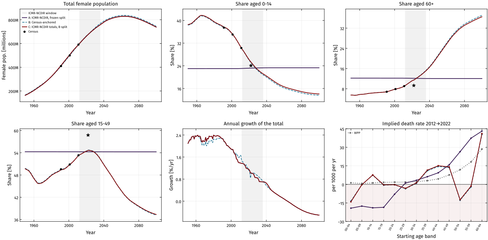
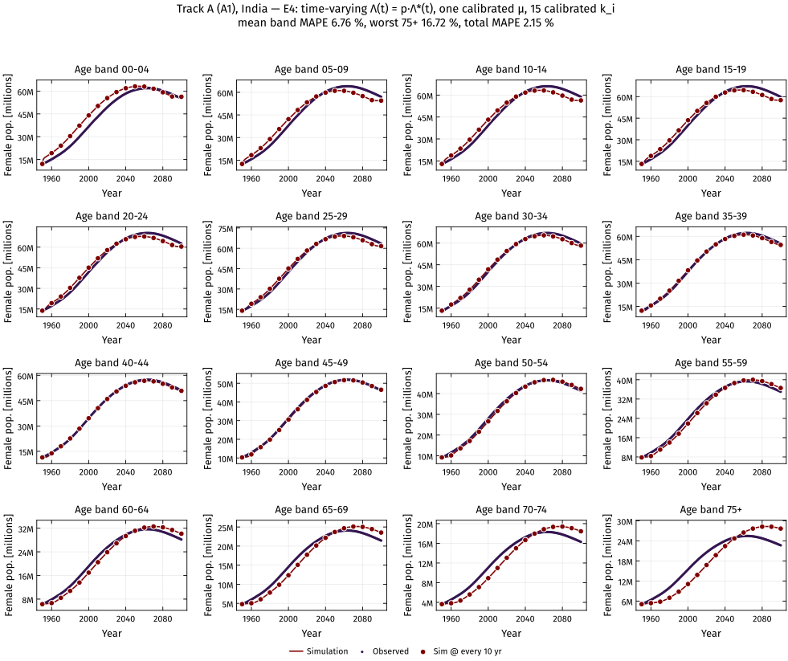
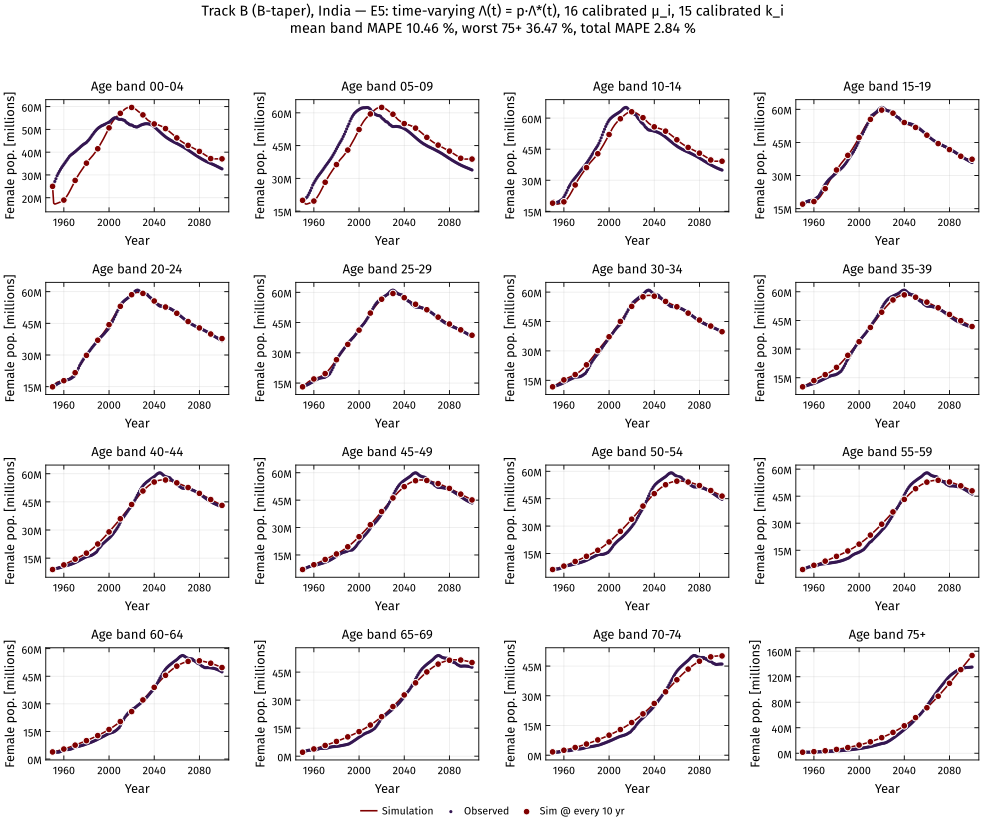

# Female population of India and its states by age, 1950–2100

Annual **female population for India and 37 states/UTs × 16 five-year age bands (00–04 … 70–74, 75+) × 1950–2100**,
combining the Census of India, UN World Population Prospects 2024 and the ICMR-NCDIR state population projections —
together with a set of **age-structured population ODE models** fitted to these series.

Use it in two ways:

- **Use the data** — pre-built CSV / Excel / Parquet files in [`outputs/`](outputs/). No code needs to run.
- **Use or extend the code** — rebuild the data, change the method, or fit the population models with the notebooks in
  [`notebooks/`](notebooks/) and the Python modules in [`src/`](src/).

<p align="center"></p>

**Contents:** [Data sources](#data-sources-and-approach) · [Three tracks](#three-versions-tracks-of-the-data) ·
[Data files](#the-data-files) · [Population models](#population-models) · [Quick start](#quick-start) ·
[Repository layout](#repository-layout) · [Methods](#methods) · [Limitations](#limitations) · [Licence](#licence)

---

## Data sources and approach

The series draw on four sources, each covering a different part of what is needed:

| Source | Coverage | Used for |
|---|---|---|
| Census of India 1991, 2001, 2011 | All states, 16 bands | Age structure at the Census years (anchors) |
| UN World Population Prospects 2024 (WPP) | India, single ages, 1950–2100 | Year-to-year dynamics and the 1950–2100 horizon |
| SRS Statistical Report 2022 | India + 22 bigger states, age distribution | Independent check of the age distributions |
| ICMR-NCDIR state population projections | 37 states/UTs, 2012–2036, 16 bands | State totals for 2012–2036 |

Bringing these together involves choices — how to carry state totals and age distributions across years, and how to extend
series beyond the years each source covers. The repository provides three constructions, documented side by side, so that
users can choose the one that suits their application.

## Three versions ("tracks") of the data

| Track | Totals | Age distribution | Suited to |
|---|---|---|---|
| **A** | ICMR-NCDIR, extended to 1950–2100 with WPP growth | As in ICMR-NCDIR (constant over 2012–2036) | Work that should reproduce the ICMR-NCDIR projections exactly |
| **B** | Census + WPP | Census-anchored, changing over time | Work that should follow the Census, e.g. fitting population-dynamics models |
| **C** | ICMR-NCDIR, extended as in A | Track B's age distribution | Work that should agree with ICMR-NCDIR totals and use a Census-anchored age structure |

- **Track A** variants: `A1` (extend the total), `A2` (extend each band), `A1-blend` / `A2-blend` (growth blended smoothly
  into WPP's at 2012 and 2036).
- **Track B** variants: `B-hold`, `B-taper`, `B-smooth` (how the Census/WPP correction behaves outside 1991–2011), each with two
  state rules (`hold`, `drift-damped`).
- **Defaults** used in the CSV files and the model notebooks: Track A `A1`, Track B `B-taper` (states: `B-taper` with the `hold` rule),
  Track C `B-taper` age distribution × `A1-blend` totals.

Notebook 01 compares the tracks against the Census, against SRS 2022 and on demographic consistency.

## The data files

All populations are **absolute numbers of females**. Mid-year values.

| File | Contents |
|---|---|
| `outputs/csv/india_female_population_by_age_1950_2100.csv` | India, all tracks and variants, long format |
| `outputs/csv/states_female_population_by_age_1950_2100_track{A,B,C}.csv` | All 37 states/UTs, long format, default variant of each track: A = `A1`, B = `B-taper_hold`, C = `B-taper_hold_A1-blend` |
| `outputs/trackA/trackA_india.xlsx` | India, one sheet per variant (A1, A1-blend, A2, A2-blend); wide (year × band + Total) |
| `outputs/trackA/trackA_states_<variant>.parquet` | States, long format, per variant |
| `outputs/trackB/trackB_india.xlsx` | India, one sheet per variant (B-hold, B-taper, B-smooth) |
| `outputs/trackB/trackB_states_<national>_<rule>.parquet` | States, long format, for every national variant (`B-hold`, `B-taper`, `B-smooth`) × state rule (`hold`, `drift-damped`) |
| `outputs/trackB/census_anchors_harmonised.csv` | Census 1991/2001/2011 harmonised to today's 37 units |
| `outputs/trackC/trackC_india_<tag>.xlsx`, `trackC_states_<tag>.parquet` | Track C, India and states |
| `outputs/model/<track tag>/` | Population-model results: fit summary, errors by band, parameters (JSON), simulations |

CSV columns: `track, variant, unit, year, band, females`.

```python
import pandas as pd
df = pd.read_csv("outputs/csv/states_female_population_by_age_1950_2100_trackC.csv")
kerala_2030 = df.query("unit == 'Kerala' and year == 2030")
```

**States/UTs.** 37 series (Andhra Pradesh and Telangana separate; Jammu & Kashmir and Ladakh separate; Dadra & Nagar Haveli and
Daman & Diu separate). **Today's boundaries are applied to all years**, including the past. India = sum of the 37 series.

## Population models

`notebooks/02–04` fit a 16-compartment aging-chain ODE to each track:

$$\frac{dP_1}{dt} = \Lambda(t) - (k_1+\mu_1)P_1,\qquad
\frac{dP_i}{dt} = k_{i-1}P_{i-1} - (k_i+\mu_i)P_i,\qquad
\frac{dP_{16}}{dt} = k_{15}P_{15} - \mu_{16}P_{16}$$

Twelve experiments vary how recruitment $\Lambda$, mortality $\mu$ and maturation $k$ are represented:

| | Constant Λ: scalar μ | vector μ | life-table μ | Time-varying Λ(t): scalar μ | vector μ | life-table μ |
|---|---|---|---|---|---|---|
| **k calibrated** | E1 | E2 | E3 | E4 | E5 | E6 |
| **k = 1/band width = 1/5** | E7 | E8 | E9 | E10 | E11 | E12 |

Mean error across bands (MAPE, India, fitted 1950–2100):

| Track | Best (E5, 32 parameters) | E11 (E5 with k = 1/5) | E12 (1 parameter) |
|---|---|---|---|
| A (A1) | 3.8 % | 20.0 % | 22.9 % |
| B (B-taper) | 10.5 % | 22.2 % | 20.3 % |
| C | 9.6 % | 21.1 % | 19.5 % |

Fixing $k_i = 1/5$ roughly doubles the band error; on Tracks B and C the 75+ band is the hardest to fit with constant mortality.
Each notebook's results section discusses the fits in detail.

**Example — Track A, E4** (time-varying Λ(t) = p·Λ*(t), one calibrated μ, calibrated k; dots = data, line = model):

<p align="center"></p>

**Example — Track B, E5** (time-varying Λ(t), calibrated μ per band, calibrated k):

<p align="center"></p>

## Quick start

```bash
git clone https://github.com/bisect-group/-india-female-pop-projections.git
cd -india-female-pop-projections
pip install -r requirements.txt
jupyter lab notebooks/
```

| Notebook | What it does | Runtime |
|---|---|---|
| `01_population_projections.ipynb` | Builds Tracks A, B, C from the raw data; diagnostics; writes `outputs/` | ~1 min |
| `02_population_model_trackA.ipynb` | Fits the 12 model experiments to Track A | ~1–2 min |
| `03_population_model_trackB.ipynb` | Same for Track B | ~1–2 min |
| `04_population_model_trackC.ipynb` | Same for Track C | ~1–2 min |

Notebooks 02–04 read the committed files in `outputs/`, so they run without notebook 01. All settings (track variant, state,
fit years, recruitment driver) are in the first code cell of each notebook; set `UNIT = "Kerala"` (or any state) to fit a state.
Figures are saved as PDF, SVG and PNG in `figures/` (not committed).

The modules can also be used directly:

```python
import sys; sys.path.insert(0, "src")
import popmodel as pm
data = pm.load_track("C", unit="Tamil Nadu")          # year x 16 bands
res = pm.fit("E12", data, pm.life_table_mu(), pm.lambda_driver(data))
print(res["metrics"]["mape"], res["k"].values)
```

## Repository layout

```
├── data/raw/            input data (see data/README.md for sources)
│   ├── census/          Census of India 1991, 2001, 2011 age-sex tables
│   ├── wpp/             WPP 2024 India female population by single age 1950–2100
│   ├── srs/             SRS Statistical Report 2022 (extracted tables; validation only)
│   ├── life_table/      female death probabilities by age group (for fixed mortality)
│   └── icmr_ncdir/      ICMR-NCDIR state female projections 2012–2036
├── notebooks/           01 data construction, 02–04 population models
├── src/                 popproj.py (data), popmodel.py (models), plotstyle.py (figure style)
├── outputs/             pre-built data products and model results
└── docs/                METHODS.md and README figures
```

## Methods

Full description, equations and choices: [`docs/METHODS.md`](docs/METHODS.md).

## Limitations

- After 2036 (Tracks A, C) and throughout (Track B), states follow India's WPP shape; there is no state-level WPP series.
- Census age-reporting patterns at the anchor years (e.g. under-count of young children, age heaping) carry into Tracks B and C.
- Tracks B and C show growth changes of up to about 2.5 percentage points per year at 1991 and 2011, where the Census/WPP
  correction moves from interpolation to extrapolation.
- State totals for 2012–2036 in Tracks A and C are used as provided by ICMR-NCDIR.
- Female population only.

## Previous version

The earlier pipeline (Census-interpolated series and custom age bands) is preserved at the tag
[`v1-legacy`](https://github.com/bisect-group/-india-female-pop-projections/tree/v1-legacy).

## Data sources and credits

See [`data/README.md`](data/README.md). Input data remain the property of their providers (Office of the Registrar General &
Census Commissioner, India; United Nations Population Division; ICMR-NCDIR); please cite them when using the data products.

## Licence

- Code (`src/`, `notebooks/`): [MIT](LICENSE).
- Derived data products (`outputs/`): [CC BY 4.0](LICENSE-DATA.md) — free to share and adapt with attribution.
- Input data (`data/raw/`): terms of their providers.

Maintained by the BISECT Lab. Issues and questions: please open a GitHub issue.
